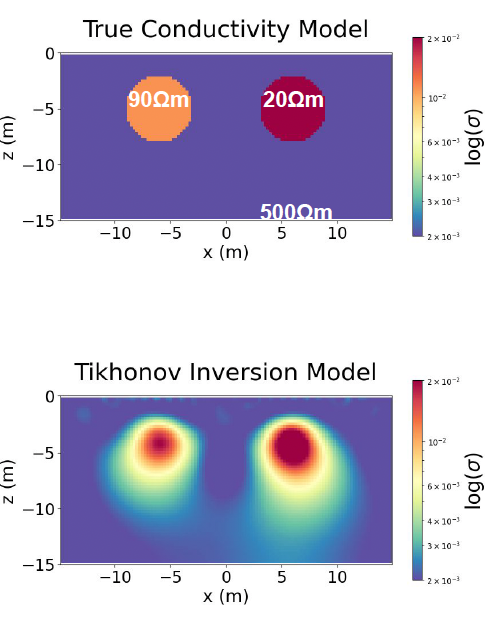

# Comparing strategies for assessing uncertainty with geophysical inversions for mineral exploration

_Johnathan C. Kuttai and Lindsey J. Heagy_

## Summary 

 Drilling plays a crucial role in exploration programs, and geophysical data often aid in choosing drill locations. Electromagnetic methods, sensitive to subsurface conductivity, are commonly used to create subsurface models for this purpose. However, geophysical inversions are inherently non-unique, as multiple Earth models can fit the data. Therefore, the uncertainty in the obtained models is of interest. However, formal uncertainty quantification poses a challenge, given the difficulty in translating the ultimate decision into a mathematical framework. Our work is to aim at using a blend of deterministic and Bayesian methods to assess uncertainty.

 Deterministic inversion produces a single maximum likelihood model where one model is then used for the interpretation. In deterministic inversion, uncertainty estimates can be obtained from regularized methods via a local linearization around a reference model (Tarantola, 2005). Other regularized methods explore the model space via norms (Fournier, 2019).

 The other approach is Bayesian where the prior is our choice of regularization which then influences the uncertainty estimates in a non-linear way. Standard approaches, such as Markov Chain Monte Carlo (MCMC) and Metropolis-Hastings, sample a posterior, but are computationally prohibitive, especially for 3D EM problems. A nice feature of these methods is that they are proven to converge with sufficient iterations. Recently, the Randomize Then Optimize (RTO) approach (Bardsley, 2014) is made less computationally expensive allowing parallel sampling. Although this method introduces a bias and does not necessarily converge, the bias has been shown to be small for 1D and 2D electromagnetic problems (Blatter, 2022). For RTO and other similar efficient randomized sampling algorithms we can get the benefits of both speed and to recover uncertainty estimations.

 In this presentation, we will explore the assessment of uncertainty in inversions of magnetotelluric and DC resistivity data by utilizing various combinations of the above methods and priors. We will explore what information can be extracted from each and assess the strengths and weaknesses for addressing uncertainty-related questions relevant to mineral exploration.

## Citation 

